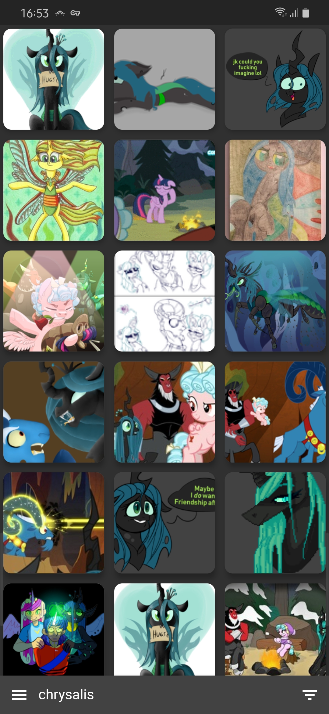
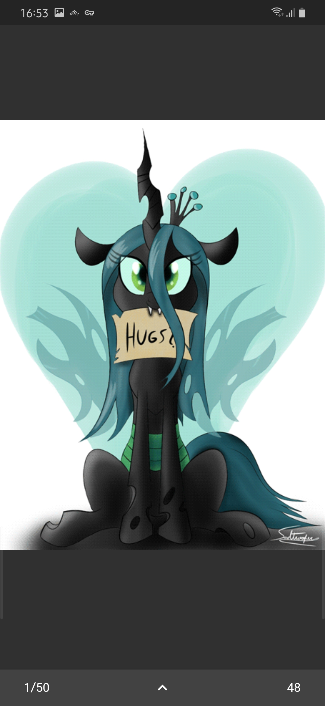
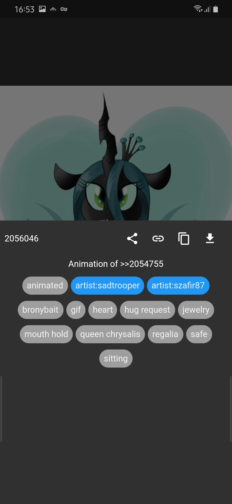
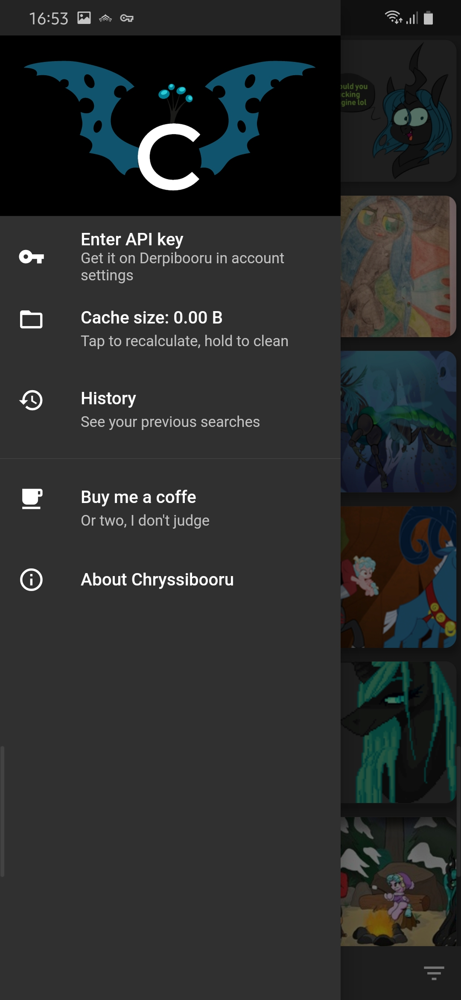

# Chryssibooru

Derpibooru client made with Flutter

## Todo

* Themes?

## Wontdo

* Likes
* Favourites
* Comments
* Anything that requires the user to log in, since Derpibooru API does not support it

## Known bugs

* An error screen will sometimes flash briefly when swiping between video files.
  It soon disappears, though, and the video loads fine. Happens only on slower devices or when loading large files.

## Screenshots

| Main grid view | Full image view | Image details | App drawer |
| -------------- | --------------- | ------------- | ---------- |
|  |  |  |  |

<!--### Main grid view-->

<!---->

<!--### Full image view-->

<!---->

<!--### Image details-->

<!---->

<!--### App drawer-->

<!---->

## Changelog

* **04.09.2019**
  * Added favourites list
  * Made history and favourites dismissable
  * Added video progress bar
  * If a video is playing, all other videos will autostart, if a video
  is paused, all other videos will be paused as well
  * Rating filter is now saved on change

* **02.06.2019**
  * Webm files now show their gif thumbnail previews in grid view!
  * Webm files in the big view *kinda* work now!

* **31.05.2019**
  * Search history now refreshes properly
  * Tapping a tag now lets you add it to your current search, remove it, or search it solo

* **30.05.2019**
  * Added search history
  * Added application info
  * Fixed filter sheet not updating
  * Fixed image download

* **29.05.2019**
  * Replaced `CachedNetworkImage` with `AdvancedNetworkImage`
  * Added image cache cleanup
  * Added progress bar for image loading
  * Share button works
  * Copy button works
  * Open in browser button works

* **28.05.2019**
  * Added Gallery view to view full images
  * Added tag list, description, score, the whole shebang
  
* **26.05.2019**
  * Grid of images now properly loads further pages
  * API key input moved to app drawer
  * Yeah, there's an app drawer now! Fancy that!
  
* **04.05.2019**
  * Modified the logo to look better
  
* **03.05.2019**
  * Added the logo image
  * Images from the 1st page display properly
  * Searching by tags and ratings works
  * Added support for the API key to allow for browsing of NSFW images

* **13.12.2018**
  * Main layout created
  
* **12.12.2018**
  * Initial commit
